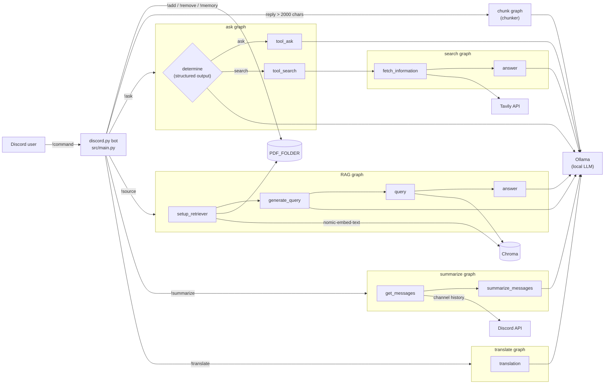

# Local-LLM Discord Assistant with LangGraph Routing and RAG

A Discord bot that answers questions, searches the web, does retrieval-augmented Q&A over uploaded PDFs, summarizes channel history, and translates text. Every LLM call runs locally through [Ollama](https://ollama.com/) and is orchestrated with [LangGraph](https://www.langchain.com/langgraph), so the core chat needs no paid LLM API key.

## Key features

- **LLM-based routing with LangGraph** (`src/feature/ask_function.py`): a conditional edge from `START` asks the model, via structured output (a Pydantic `Literal["ask", "search"]`), to classify each `!ask` request as either static knowledge or needing live information. The request then goes to a direct-answer node or to a Tavily web-search subgraph.
- **Grounded web search** (`src/util/search_function.py`): fetches the top 3 [Tavily](https://tavily.com/) results and has the local model answer using only that context.
- **RAG over user-uploaded PDFs** (`src/feature/ask_source_function.py`): a four-node pipeline: `setup_retriever` → `generate_query` → `query` → `answer`.
  - Text is extracted with `pypdf` and split with LangChain's `RecursiveCharacterTextSplitter` (`chunk_size=800`, `chunk_overlap=100`).
  - Chunks are embedded with `nomic-embed-text` via `OllamaEmbeddings` and stored in a [Chroma](https://www.trychroma.com/) vector store.
  - The LLM rewrites the user's question into a keyword-focused search query before retrieval (top `k=3`).
  - Retrieved chunks are tagged with their source filename, which is passed to the answer prompt so the model can cite it.
- **Channel summarization by date range** (`src/feature/chat_summarize_function.py`): an async graph pulls up to 2000 non-bot messages from the channel between two dates and summarizes them.
- **Translation with structured output** (`src/feature/translate_function.py`): returns the detected source language and the translation as typed fields.
- **Automatic chunking for Discord's 2000-character limit** (`src/util/chunk_output.py`): when a reply goes over 2000 characters, a `temperature=0` LLM call splits it into an ordered list of chunks, and each chunk is sent as its own reply.
- **PDF store management**: `!add`, `!remove`, and `!memory` save, delete, and list files in a local folder (`PDF_FOLDER`). `!add` skips attachments that aren't `.pdf` files.

## Architecture



Each feature is its own compiled `StateGraph` with a small `TypedDict` state, and `src/main.py` handles only Discord I/O. This keeps each pipeline independently testable. It also makes control flow explicit: routing is a conditional edge, not hidden inside a prompt. The search pipeline is a separate graph that the `!ask` graph calls from its `tool_search` node, so it could be reused by other features.

## Tech stack

- Python
- `discord.py` (commands extension)
- LangGraph (`StateGraph`)
- LangChain (`langchain-core`, `langchain-ollama`, `langchain-text-splitters`, `langchain-chroma`, `langchain-tavily`)
- Ollama: chat model set by `MODEL`, embeddings from `nomic-embed-text`
- Chroma (vector store)
- Tavily (web search)
- `pypdf` (PDF text extraction)
- Pydantic (structured output schemas)
- `python-dotenv` (configuration)

## Commands

| Command | Description | Usage |
|---|---|---|
| `!help` | Shows the list of commands | `!help` |
| `!ask` | Ask a question. Automatically routes to a live web search (via Tavily) if the question needs current information, or answers directly from the model otherwise | `!ask [your question]` |
| `!summarize` | Summarizes channel messages between two dates | `!summarize [YYYY-MM-DD] \| [YYYY-MM-DD]` |
| `!add` | Uploads and saves PDF attachments to Tazuna's memory (non-PDF files are skipped) | `!add` (with file attachment) |
| `!remove` | Removes a saved PDF, or all of them | `!remove [filename]` or `!remove all` |
| `!memory` | Lists all PDFs currently saved | `!memory` |
| `!source` | Ask a question answered using retrieval over your saved PDFs (RAG) | `!source [your question]` |
| `!translate` | Translates text into a target language | `!translate [text] \| [language]` |

## Setup

### Prerequisites

- Python 3.10+
- [Ollama](https://ollama.com/) installed and running locally
- A Discord bot application with the **Message Content** privileged intent enabled. The bot sets `intents.message_content = True`.
- A [Tavily](https://tavily.com/) API key (used only by the web-search route of `!ask`)

### Install dependencies

The repo does not include a `requirements.txt` or `pyproject.toml` yet. These are the packages imported in `src/`:

```bash
pip install discord.py python-dotenv langgraph langchain-core langchain-ollama \
    langchain-text-splitters langchain-chroma langchain-tavily pypdf pydantic requests
```

### Pull the Ollama models

```bash
ollama pull <your-chat-model>   # the model name you set in MODEL
ollama pull nomic-embed-text    # embedding model used by !source
```

Routing, translation, and chunking all depend on structured output, so choose a chat model that follows JSON schemas reliably.

### Environment variables

Create a `.env` file in the directory you run the bot from (`.env` is gitignored):

```env
DISCORD_BOT_TOKEN=     # Discord bot token (src/main.py)
MODEL=                 # Ollama chat model name, e.g. the one you pulled above
TAVILY_API_KEY=        # read by langchain-tavily's TavilySearch
PDF_FOLDER=            # folder where uploaded PDFs are stored, e.g. pdf_files
```

Optional: LangChain automatically picks up the standard LangSmith variables (`LANGSMITH_TRACING`, `LANGSMITH_ENDPOINT`, `LANGSMITH_API_KEY`, `LANGSMITH_PROJECT`) if you want to trace graph runs. Nothing in `src/` references them directly.

### Run

```bash
python src/main.py
```

`src/` is added to the import path, so the `config.*`, `feature.*`, and `util.*` imports resolve. A relative `PDF_FOLDER` is resolved against your current working directory.

## Design decisions and limitations

- **Local inference over hosted APIs.** All generation and embedding runs through Ollama, so there are no per-token costs and PDFs and chat logs stay on the host machine. The tradeoffs: answer quality and latency depend on the local model and hardware, and calls are synchronous inside the Discord command handlers.
- **LLM-as-router.** Routing `!ask` with a structured-output classification call is simple and needs no training data. However, it adds an extra LLM call to every request, and it relies on the model's judgment. The router prompt hard-codes a knowledge cutoff date (December 2023), which may not match the model you actually run.
- **The RAG index is rebuilt on every query.** `setup_retriever` re-reads every PDF in `PDF_FOLDER`, re-embeds all of it, and builds a new in-memory Chroma store on each `!source` call. This keeps the index trivially in sync with `!add`/`!remove`, but cost grows with corpus size. A persistent index with incremental updates would be the next step.
- **LLM-based chunking is not guaranteed.** The chunker *instructs* the model to keep every word and stay under 2000 characters, but the code does not verify either. A deterministic splitter would be cheaper and safe.
- **Context and testing gaps.** `!summarize` sends the whole date range in a single prompt, so long ranges can exceed the model's context window. There are no automated tests.

## Persona

For fun, the bot answers as **Tazuna Hayakawa**, secretary to the director of Tracen Academy in *Umamusume: Pretty Derby*. The persona is a shared system prompt in `src/config/prompt_template.py` (`PromptTemplate.prompt`). It is prepended to the answer, search, RAG, summarization, and translation prompts, so you can rebrand the assistant by editing that one string. The in-character `!help` text lives in `src/config/help_message.py`.
